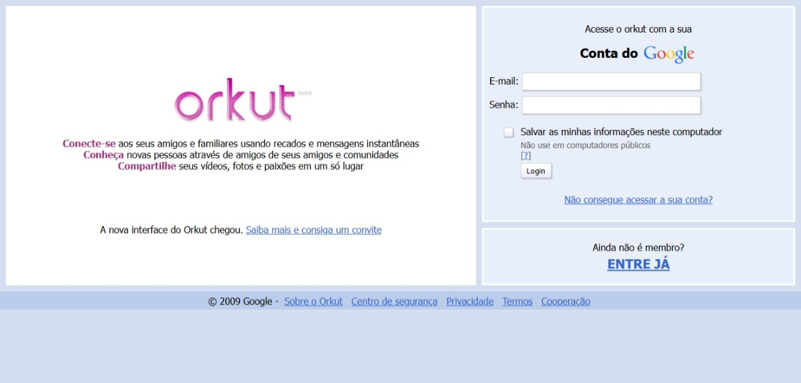
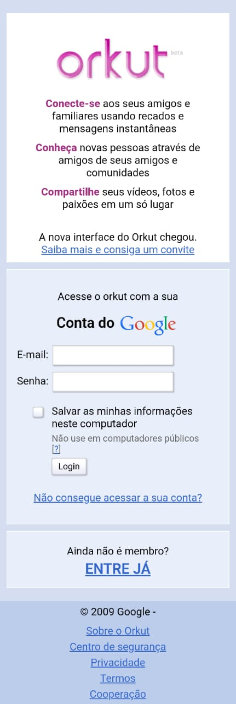

# Reprodução do Layout de Login do Orkut (HTML e CSS)

Este repositório contém uma atividade prática da disciplina **Desenvolvimento Web**.

## Tecnologias Utilizadas

- HTML5
- CSS3
- Sem uso de Flexbox ou Grid

## Sobre o Projeto

A proposta foi reproduzir a tela de login do Orkut, como ela era por volta de **2008-2009**, utilizando apenas **HTML e CSS puro**, **sem o uso de Flexbox ou Grid**, uma vez que esses recursos ainda não estavam disponíveis nas versões utilizadas naquela época.

## Estrutura

A tela é composta por dois blocos principais, simulando o layout clássico:

- **Lado esquerdo**: contém a logomarca do Orkut e uma breve mensagem de boas-vindas.
- **Lado direito**: apresenta o formulário de login com campos para e-mail e senha, além de botões de login e links para criar conta e recuperar a senha.

Todos os elementos foram organizados com uso de posicionamento clássico via `float`, `position`, `margin` e `padding`, respeitando as restrições da época e mantendo a estética visual próxima do que era utilizado na interface original.

### Versão Desktop


### Versão Mobile


## Como visualizar
1. **Clonar o repositório localmente**  
   Clone este repositório com o seguinte comando:

   ```bash
   git clone https://github.com/iris-souza/pratica-reproducao-orkut

Você pode abrir o arquivo `index.html` diretamente no navegador.
2. **Acessar a versão publicada no GitHub Pages**
    https://iris-souza.github.io/pratica-reproducao-orkut/

## Observações

Essa atividade foi realizada como parte do conteúdo prático da disciplina, com o objetivo de exercitar conhecimentos de estruturação e estilização de páginas web.
